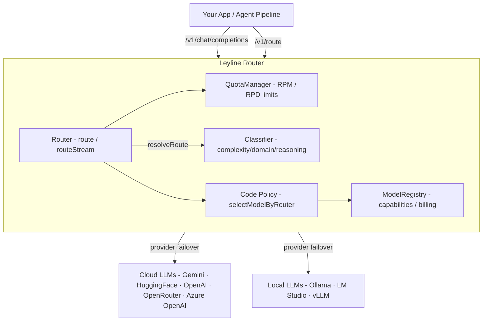
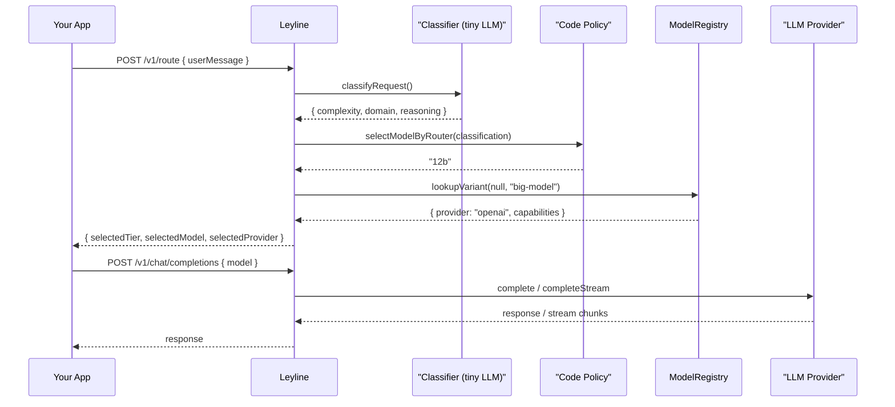
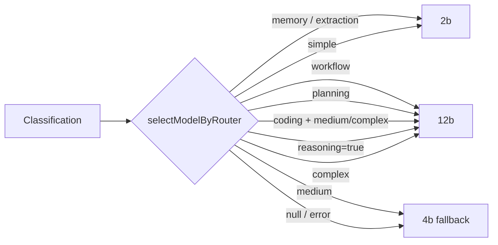
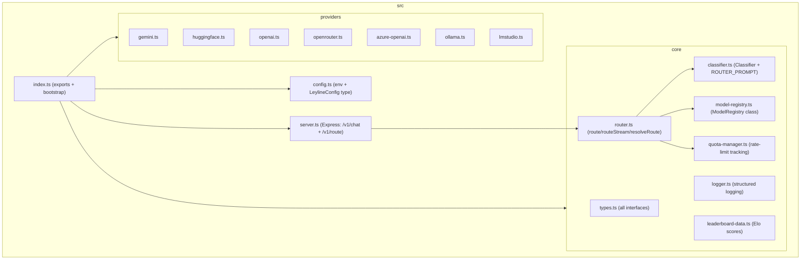

# Leyline 🔮


**The ultimate cost-optimizing LLM load balancer, semantic router & gateway.**

Leyline unifies multiple LLM providers — cloud (Gemini, HuggingFace, OpenAI, OpenRouter, Azure OpenAI), local (Ollama, LM Studio), and custom — into a single API. It handles failover, rate-limit management, and now includes a **semantic router** that classifies requests by complexity/domain and selects the optimal model tier.



## ✨ Key Features

- **🛡️ Resilient Routing**: Automatically falls back to the next provider if one fails or hits rate limits.
- **🌊 Seamless Streaming**: Recovers from mid-stream failures by stitching context transparently.
- **🧠 Semantic Router**: Classifies requests by complexity (`simple`/`medium`/`complex`), domain (`chat`/`coding`/`planning`/`workflow`/`memory`/`extraction`), and reasoning requirement.
- **🎯 Tiered Model Selection**: Applies a deterministic code policy to map classification → model tier (2B/4B/12B), so routing policy can evolve without retraining the classifier.
- **📦 Configurable Model Registry**: Bring your own model variants via JSON — define capabilities, billing class, resource class, provider, and context length externally.
- **🏠 Local Model Support**: Built-in provider for LM Studio / any OpenAI-compatible local endpoint.
- **📊 React Dashboard**: Monitor network status, rate limits, request logs, and API key persistence at `/dashboard`.
- **📈 Agent Analytics**: Insights into "Most Popular", "Fastest", and "Highest Quality" (Elo-rated) models.
- **🔍 Model Discovery**: Search and filter through thousands of available models from connected providers.
- **🔌 OpenAI Compatible**: Drop-in replacement for OpenAI SDKs (`/v1/chat/completions`).

## 📦 Installation

```bash
npm install @theaiinc/leyline
```

## 🚀 Quick Start

### 1. Standalone Server

Create a `.env` file:

```bash
# ── Cloud Providers ────────────────────────────────────────
GEMINI_API_KEY=your_key
HF_API_KEY=your_key
OPENAI_API_KEY=your_key
OPENAI_DEFAULT_MODEL=gpt-5.5
OPENROUTER_API_KEY=your_key
AZURE_OPENAI_API_KEY=your_key
AZURE_OPENAI_BASE_URL=https://your-resource.services.ai.azure.com/openai/v1
AZURE_OPENAI_DEFAULT_MODEL=gpt-5.5

# Optional dashboard persistence for runtime API keys
LEYLINE_KEYCHAIN_ENABLED=true
LEYLINE_KEYCHAIN_SERVICE=@theaiinc/leyline

# ── Router / Classifier Model (optional) ───────────────────
# A lightweight model like arch-router-1.5b.gguf
LEYLINE_ROUTER_MODEL=
LEYLINE_OPENAI_BASE_URL=http://localhost:1234/v1

# ── Single Model Mode (optional) ───────────────────────────
# Disable dynamic routing/failover and force one model
LEYLINE_ROUTER_ENABLED=true
LEYLINE_FIXED_PROVIDER=
LEYLINE_FIXED_MODEL=

# ── Model Tier Resolution (optional) ───────────────────────
# Maps tier labels to actual model names
LEYLINE_MODEL_2B=google/gemma-4-e2b
LEYLINE_MODEL_4B=qwen3:8b
LEYLINE_MODEL_12B=google/gemma-4-12b

# ── Custom Variant Registry (optional) ─────────────────────
# Full JSON array of ModelVariant objects (overrides defaults)
LEYLINE_CUSTOM_VARIANTS=
```

Run the router:

```bash
npx @theaiinc/leyline
```

The API will be available at `http://localhost:3000`. On startup Leyline also launches a **Cloudflare quick tunnel** (via `cloudflared`) and prints a public `trycloudflare.com` URL — use that when cloud clients block private networks (e.g. "Access to private networks is forbidden").

Set `LEYLINE_TUNNEL_ENABLED=false` if you do not want the tunnel, or install [cloudflared](https://developers.cloudflare.com/cloudflare-one/connections/connect-networks/downloads/) if it is missing.

#### Client API keys (calling Leyline)

Leyline validates incoming `Authorization` headers on `/v1/chat/completions` and `/v1/route`. The default client API key is **`leyline`** — this is separate from provider credentials (Azure OpenAI, OpenAI, Gemini, etc.), which are configured in Leyline itself via `.env` or the `/dashboard` API key panel.

When using the OpenAI SDK against Leyline at `http://localhost:3000/v1`:

```typescript
const client = new OpenAI({
  baseURL: 'http://localhost:3000/v1',
  apiKey: 'leyline',
});
```

Or pass the header directly:

```bash
curl -H "Authorization: Bearer leyline" ...
```

Set `LEYLINE_CLIENT_API_KEY` to change the expected key, or `LEYLINE_CLIENT_AUTH_ENABLED=false` to disable client auth (legacy behavior).

Do **not** pass your Azure or OpenAI provider key to Leyline clients. Configure `AZURE_OPENAI_API_KEY` (or save it in `/dashboard` under `AzureOpenAI`) on the Leyline server instead.

### 2. Usage as a Library

```typescript
import {
  Router, ModelRegistry, Classifier,
  GeminiProvider, OpenAIProvider, AzureOpenAIProvider, LMStudioProvider, QuotaManager,
} from '@theaiinc/leyline';

// ── Tiered routing with classifier ────────────────────────

const classifyFn = async (system: string, userMessage: string) => {
  const response = await fetch('http://localhost:1234/v1/chat/completions', {
    method: 'POST',
    headers: { 'Content-Type': 'application/json' },
    body: JSON.stringify({
      model: 'arch-router-1.5b.gguf',
      messages: [
        { role: 'system', content: system },
        { role: 'user', content: userMessage },
      ],
      max_tokens: 64,
      temperature: 0,
    }),
  });
  const data = await response.json();
  return data.choices[0]?.message?.content || '';
};

const router = new Router({
  classifier: new Classifier(classifyFn),
  tierConfig: {
    '2b': 'google/gemma-4-e2b',
    '4b': 'qwen3:8b',
    '12b': 'google/gemma-4-12b',
  },
});

// Get a routing decision before making the call
const route = await router.resolveRoute({
  userMessage: 'build a todo app with react',
  chatHistory: [],
});
console.log(route);
// → { classification: { complexity: 'complex', domain: 'coding', reasoning: true },
//     selectedTier: '12b',
//     selectedModel: 'google/gemma-4-12b',
//     selectedProvider: 'openai' }

// ── Provider failover with quota management ────────────────

const qm = new QuotaManager();
qm.setQuota('Gemini', { requestsPerMinute: 10, requestsPerDay: 1000 });

const failoverRouter = new Router({ quotaManager: qm });
failoverRouter.addProvider(new GeminiProvider(process.env.GEMINI_API_KEY));
failoverRouter.addProvider(new OpenAIProvider(process.env.OPENAI_API_KEY));
failoverRouter.addProvider(new AzureOpenAIProvider());
failoverRouter.addProvider(new LMStudioProvider('http://localhost:1234/v1'));

const response = await failoverRouter.route({
  model: 'auto',
  messages: [{ role: 'user', content: 'Hello!' }],
});
console.log(response.choices[0].message.content);

// Streaming with mid-stream failover stitching
for await (const chunk of failoverRouter.routeStream({
  model: 'mistralai/mistral-7b-instruct',
  messages: [{ role: 'user', content: 'Tell me a story.' }],
})) {
  process.stdout.write(chunk.choices[0].delta.content || '');
}
```

## 🧠 Architecture

### Routing Flow



### Classifier Prompt

The classifier uses a lightweight LLM (e.g. `arch-router-1.5b.gguf`) with a 3-line structured output format:

```text
COMPLEXITY: simple | medium | complex
DOMAIN: chat | coding | planning | workflow | memory | extraction
REASONING: true | false
```

The output is parsed and fed into the code policy — a deterministic function that maps classification → model tier. This keeps routing policy flexible without retraining the model.

### Code Policy (Default)



### Package Structure



## 🖥️ Dashboard

Access the dashboard at `http://localhost:3000/dashboard` to view:

- **Network Status**: Real-time quota usage and provider health.
- **Runtime API Keys**: Set or clear cloud provider API keys without editing `.env`.
- **Key Persistence**: Choose Apple Keychain, browser `localStorage`, or server memory per provider.
- **Azure Runtime Settings**: Edit Azure OpenAI base URL and model/deployment for the current server process.
- **Model Explorer**: Searchable list of all available models with descriptions and specs.
- **Leaderboards**:
  - **🏆 Usage**: Your most frequent models.
  - **⚡ Latency**: Fastest response times.
  - **🌟 Quality**: Models ranked by LMSYS Elo ratings (GPT-4o, Claude 3.5, etc.).

Dashboard key behavior:

- `.env` keys are treated as explicit startup configuration and take precedence over Keychain during startup.
- If a provider has no `.env` key, Leyline attempts to load a saved dashboard key from Apple Keychain when Keychain is enabled and available.
- A missing Keychain item is normal for providers that have not been saved yet; it should show as **Missing key**, not as a Keychain failure.
- Saving a key from the dashboard updates the running provider immediately. Keychain saves persist across server restarts; memory saves last only for the current server process.
- Browser `localStorage` is optional and browser-local. The dashboard stores the key in that browser and re-sends it to the server when the dashboard loads, but the server never returns raw key values.
- If the dashboard says Apple Keychain lookup/save/delete failed, check macOS Keychain permissions or set `LEYLINE_KEYCHAIN_ENABLED=false` to run in memory-only mode. Memory and `localStorage` remain optional fallbacks.
- Blank key fields never clear a key. Use the explicit **Clear Key** action, which keeps runtime URL/model settings intact.

## 🛠️ Configuration

### Environment Variables

| Variable | Default | Description |
| :--- | :--- | :--- |
| `PORT` | `3000` | HTTP listen port |
| `GEMINI_API_KEY` | — | Google AI Studio API key |
| `HF_API_KEY` | — | Hugging Face access token |
| `OPENAI_API_KEY` | — | OpenAI API key |
| `OPENAI_DEFAULT_MODEL` | `gpt-5.5` | Default model for the OpenAI provider |
| `OPENAI_BASE_URL` | `https://api.openai.com/v1` | OpenAI-compatible base URL for the OpenAI provider |
| `OPENROUTER_API_KEY` | — | OpenRouter API key |
| `AZURE_OPENAI_API_KEY` | — | Azure OpenAI API key |
| `AZURE_OPENAI_BASE_URL` | — | OpenAI-compatible Azure base URL, e.g. `https://your-resource.services.ai.azure.com/openai/v1` |
| `AZURE_OPENAI_DEFAULT_MODEL` | `gpt-5.5` | Default model for OpenAI-compatible Azure endpoints |
| `AZURE_OPENAI_ENDPOINT` | — | Legacy Azure resource endpoint, e.g. `https://your-resource.openai.azure.com` |
| `AZURE_OPENAI_DEPLOYMENT` | — | Legacy Azure deployment name used as the default model |
| `AZURE_OPENAI_API_VERSION` | `2024-10-21` | Azure OpenAI chat completions API version |
| `PORT` | `3000` | HTTP server port |
| `LEYLINE_CLIENT_API_KEY` | `leyline` | Expected Bearer token for `/v1/chat/completions` and `/v1/route` |
| `LEYLINE_CLIENT_AUTH_ENABLED` | `true` | Set to `false` to disable client auth validation |
| `LEYLINE_TUNNEL_ENABLED` | `true` | Start a Cloudflare quick tunnel on boot and expose a public URL |
| `LEYLINE_TUNNEL_BINARY` | `cloudflared` | Path to the cloudflared binary |
| `LEYLINE_TUNNEL_TIMEOUT_MS` | `45000` | Max wait for the public tunnel URL on startup |
| `LEYLINE_KEYCHAIN_ENABLED` | `true` | Enable Apple Keychain persistence for dashboard-saved API keys on macOS |
| `LEYLINE_KEYCHAIN_SERVICE` | `@theaiinc/leyline` | Apple Keychain service name used for saved provider API keys |
| `GEMINI_QUOTA_RPM` | `10` | Gemini requests per minute limit |
| `GEMINI_QUOTA_RPD` | `1000` | Gemini requests per day limit |
| `HF_QUOTA_RPM` | `100` | HuggingFace RPM limit |
| `OPENAI_QUOTA_RPM` | `60` | OpenAI RPM limit |
| `OPENAI_QUOTA_RPD` | `1000` | OpenAI daily request limit |
| `OPENROUTER_QUOTA_RPM` | `20` | OpenRouter RPM limit |
| `AZURE_OPENAI_QUOTA_RPM` | `60` | Azure OpenAI RPM limit |
| `AZURE_OPENAI_QUOTA_RPD` | `1000` | Azure OpenAI daily request limit |

Cloud provider API keys can also be set from `/dashboard`. Raw keys are accepted only in save/rehydration requests and are never returned by dashboard APIs.

For the Azure OpenAI-compatible endpoint shape used by the OpenAI SDK, configure:

```bash
AZURE_OPENAI_BASE_URL=https://otlrs-dev-agents-resource.services.ai.azure.com/openai/v1
AZURE_OPENAI_DEFAULT_MODEL=gpt-5.5
LEYLINE_ROUTER_ENABLED=false
LEYLINE_FIXED_PROVIDER=AzureOpenAI
LEYLINE_FIXED_MODEL=gpt-5.5
```

Then paste the Azure API key into `/dashboard` under `AzureOpenAI`, or set `AZURE_OPENAI_API_KEY` in `.env`.

### Router / Classifier

| Variable | Default | Description |
| :--- | :--- | :--- |
| `LEYLINE_ROUTER_MODEL` | — | Lightweight model for request classification (e.g. `arch-router-1.5b.gguf`) |
| `LEYLINE_OPENAI_BASE_URL` | `http://localhost:1234/v1` | Base URL for the router model's LLM endpoint |
| `LEYLINE_ROUTER_MAX_TOKENS` | `64` | Max output tokens (router output is 3 lines) |
| `LEYLINE_ROUTER_TEMPERATURE` | `0` | Router model temperature (0 = deterministic) |
| `LEYLINE_ROUTER_ENABLED` | `true` | Set to `false` to disable dynamic routing/failover and use one fixed model |
| `LEYLINE_FIXED_PROVIDER` | — | Provider for fixed model mode, e.g. `OpenAI`, `AzureOpenAI`, `Ollama`; optional when the model exists in the registry |
| `LEYLINE_FIXED_MODEL` | — | Model/deployment used for every chat completion when router is disabled |

To force one model, set:

```bash
LEYLINE_ROUTER_ENABLED=false
LEYLINE_FIXED_PROVIDER=OpenAI
LEYLINE_FIXED_MODEL=gpt-5.5
```

When fixed model mode is enabled, `/v1/chat/completions` ignores the request `model` and sends every request to the configured provider/model. `/v1/route` returns a fixed routing decision instead of calling the classifier.

### Tier → Model Resolution

| Variable | Default | Description |
| :--- | :--- | :--- |
| `LEYLINE_MODEL_2B` | — | Model name for the 2B tier (utility) |
| `LEYLINE_MODEL_4B` | — | Model name for the 4B tier (operational) |
| `LEYLINE_MODEL_12B` | — | Model name for the 12B tier (cognitive) |

### Custom Variants

| Variable | Description |
| :--- | :--- |
| `LEYLINE_CUSTOM_VARIANTS` | JSON array of `ModelVariant[]`. If set, replaces the built-in default registry entirely. |

### Local Models

| Variable | Default | Description |
| :--- | :--- | :--- |
| `LMSTUDIO_BASE_URL` | `http://localhost:1234/v1` | Base URL for LM Studio / OpenAI-compatible endpoint |
| `LMSTUDIO_MODEL` | — | Default model for the LM Studio provider |

### Prompt Compression (optional)

Leyline can optionally compress prompts and context before sending to LLM providers using [`@theaiinc/headroom-ai`](https://github.com/theaiinc/headroom-ai) — a library-only fork of [chopratejas/headroom](https://github.com/chopratejas/headroom) (Apache-2.0, original author credited).

Compression is **off by default** and requires the Python package:

```bash
pip install headroom-ai
```

| Variable | Default | Description |
| :--- | :--- | :--- |
| `LEYLINE_COMPRESSION_ENABLED` | `false` | Set to `true` to enable prompt compression |
| `LEYLINE_COMPRESSION_MODEL` | — | Model hint sent to headroom-ai for compression routing |
| `LEYLINE_COMPRESSION_TOKEN_BUDGET` | — | Optional token budget — compress to fit within this limit |

When enabled, `Router.route()` and `Router.routeStream()` automatically compress messages before sending to providers. The compressor spawns `headroom-compress` (the Python CLI), passing messages as JSON on stdin and receiving compressed messages as JSON on stdout.

### Exported Types

```typescript
import type {
  ModelVariant, BillingClass, ResourceClass, ApiKeyConfigurableProvider,
  RouterClassification, ClassifyRequest, RouteResult, TierConfig,
  LeylineConfig, RouterModelConfig, QuotaConfig, SingleModelConfig,
  RouterOptions, SingleModelRouterConfig, ClassifyFn,
  Provider, CompletionRequest, CompletionResponse, StreamChunk,
} from '@theaiinc/leyline';
```

## 🤝 Contributing

We welcome contributions! Please feel free to submit a Pull Request.

## 📄 License

MIT — © 2025-2026 The AI Inc
