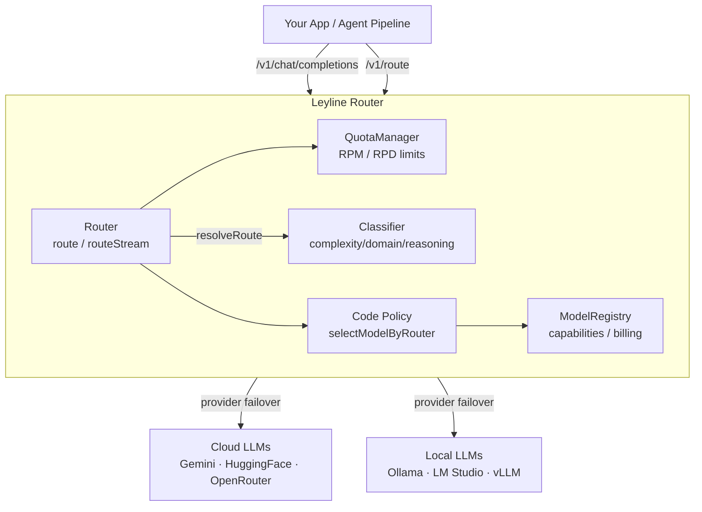
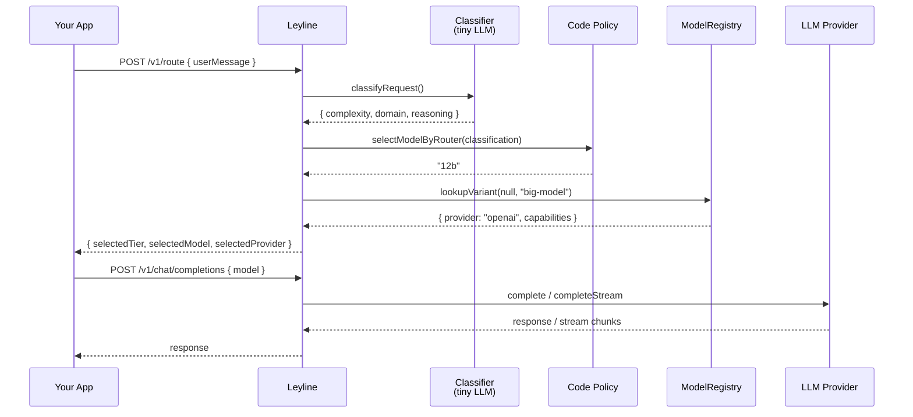
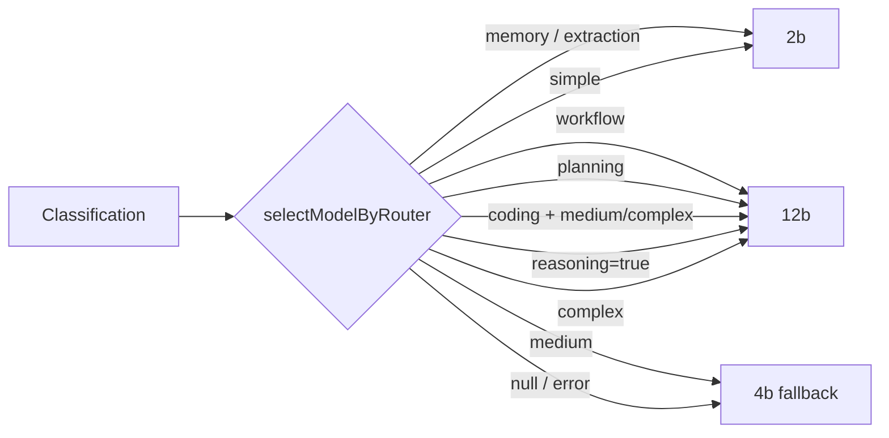

# Leyline 🔮


**The ultimate cost-optimizing LLM load balancer, semantic router & gateway.**

Leyline unifies multiple LLM providers — cloud (Gemini, HuggingFace, OpenRouter), local (Ollama, LM Studio), and custom — into a single API. It handles failover, rate-limit management, and now includes a **semantic router** that classifies requests by complexity/domain and selects the optimal model tier.



## ✨ Key Features

- **🛡️ Resilient Routing**: Automatically falls back to the next provider if one fails or hits rate limits.
- **🌊 Seamless Streaming**: Recovers from mid-stream failures by stitching context transparently.
- **🧠 Semantic Router**: Classifies requests by complexity (`simple`/`medium`/`complex`), domain (`chat`/`coding`/`planning`/`workflow`/`memory`/`extraction`), and reasoning requirement.
- **🎯 Tiered Model Selection**: Applies a deterministic code policy to map classification → model tier (2B/4B/12B), so routing policy can evolve without retraining the classifier.
- **📦 Configurable Model Registry**: Bring your own model variants via JSON — define capabilities, billing class, resource class, provider, and context length externally.
- **🏠 Local Model Support**: Built-in provider for LM Studio / any OpenAI-compatible local endpoint.
- **📊 Real-time Dashboard**: Monitor network status, rate limits, and request logs at `/dashboard`.
- **📈 Agent Analytics**: Insights into "Most Popular", "Fastest", and "Highest Quality" (Elo-rated) models.
- **🔍 Model Discovery**: Search and filter through thousands of available models from connected providers.
- **🔌 OpenAI Compatible**: Drop-in replacement for OpenAI SDKs (`/v1/chat/completions`).

## 📦 Installation

```bash
npm install @theaiinc/leyline
```

## 🚀 Quick Start

### 1. Standalone Server

Create a `.env` file:

```bash
# ── Cloud Providers ────────────────────────────────────────
GEMINI_API_KEY=your_key
HF_API_KEY=your_key
OPENROUTER_API_KEY=your_key

# ── Router / Classifier Model (optional) ───────────────────
# A lightweight model like arch-router-1.5b.gguf
LEYLINE_ROUTER_MODEL=
LEYLINE_OPENAI_BASE_URL=http://localhost:1234/v1

# ── Model Tier Resolution (optional) ───────────────────────
# Maps tier labels to actual model names
LEYLINE_MODEL_2B=google/gemma-4-e2b
LEYLINE_MODEL_4B=qwen3:8b
LEYLINE_MODEL_12B=google/gemma-4-12b

# ── Custom Variant Registry (optional) ─────────────────────
# Full JSON array of ModelVariant objects (overrides defaults)
LEYLINE_CUSTOM_VARIANTS=
```

Run the router:

```bash
npx @theaiinc/leyline
```

The API will be available at `http://localhost:3000`.

### 2. Usage as a Library

```typescript
import {
  Router, ModelRegistry, Classifier,
  GeminiProvider, LMStudioProvider, QuotaManager,
} from '@theaiinc/leyline';

// ── Tiered routing with classifier ────────────────────────

const classifyFn = async (system: string, userMessage: string) => {
  const response = await fetch('http://localhost:1234/v1/chat/completions', {
    method: 'POST',
    headers: { 'Content-Type': 'application/json' },
    body: JSON.stringify({
      model: 'arch-router-1.5b.gguf',
      messages: [
        { role: 'system', content: system },
        { role: 'user', content: userMessage },
      ],
      max_tokens: 64,
      temperature: 0,
    }),
  });
  const data = await response.json();
  return data.choices[0]?.message?.content || '';
};

const router = new Router({
  classifier: new Classifier(classifyFn),
  tierConfig: {
    '2b': 'google/gemma-4-e2b',
    '4b': 'qwen3:8b',
    '12b': 'google/gemma-4-12b',
  },
});

// Get a routing decision before making the call
const route = await router.resolveRoute({
  userMessage: 'build a todo app with react',
  chatHistory: [],
});
console.log(route);
// → { classification: { complexity: 'complex', domain: 'coding', reasoning: true },
//     selectedTier: '12b',
//     selectedModel: 'google/gemma-4-12b',
//     selectedProvider: 'openai' }

// ── Provider failover with quota management ────────────────

const qm = new QuotaManager();
qm.setQuota('Gemini', { requestsPerMinute: 10, requestsPerDay: 1000 });

const failoverRouter = new Router({ quotaManager: qm });
failoverRouter.addProvider(new GeminiProvider(process.env.GEMINI_API_KEY));
failoverRouter.addProvider(new LMStudioProvider('http://localhost:1234/v1'));

const response = await failoverRouter.route({
  model: 'auto',
  messages: [{ role: 'user', content: 'Hello!' }],
});
console.log(response.choices[0].message.content);

// Streaming with mid-stream failover stitching
for await (const chunk of failoverRouter.routeStream({
  model: 'mistralai/mistral-7b-instruct',
  messages: [{ role: 'user', content: 'Tell me a story.' }],
})) {
  process.stdout.write(chunk.choices[0].delta.content || '');
}
```

## 🧠 Architecture

### Routing Flow



### Classifier Prompt

The classifier uses a lightweight LLM (e.g. `arch-router-1.5b.gguf`) with a 3-line structured output format:

```text
COMPLEXITY: simple | medium | complex
DOMAIN: chat | coding | planning | workflow | memory | extraction
REASONING: true | false
```

The output is parsed and fed into the code policy — a deterministic function that maps classification → model tier. This keeps routing policy flexible without retraining the model.

### Code Policy (Default)



### Package Structure

```mermaid
graph TD
    subgraph src
        index[<b>index.ts</b><br/>(exports + bootstrap)]
        config[<b>config.ts</b><br/>(env + LeylineConfig type)]
        server[<b>server.ts</b><br/>(Express: /v1/chat + /v1/route)]

        subgraph core
            types[<b>types.ts</b><br/>(all interfaces)]
            router[<b>router.ts</b><br/>(route/routeStream/resolveRoute)]
            modelRegistry[<b>model-registry.ts</b><br/>(ModelRegistry class)]
            classifier[<b>classifier.ts</b><br/>(Classifier + ROUTER_PROMPT)]
            quotaManager[<b>quota-manager.ts</b><br/>(rate-limit tracking)]
            logger[<b>logger.ts</b><br/>(structured logging)]
            leaderboard[<b>leaderboard-data.ts</b><br/>(Elo scores)]
        end

        subgraph providers
            gemini[<b>gemini.ts</b>]
            huggingface[<b>huggingface.ts</b>]
            openrouter[<b>openrouter.ts</b>]
            ollama[<b>ollama.ts</b>]
            lmstudio[<b>lmstudio.ts</b>]
        end
    end

    index --> config
    index --> server
    index --> core
    index --> providers
    server --> router
    router --> classifier
    router --> modelRegistry
    router --> quotaManager
```

## 🖥️ Dashboard

Access the dashboard at `http://localhost:3000/dashboard` to view:

- **Network Status**: Real-time quota usage and provider health.
- **Model Explorer**: Searchable list of all available models with descriptions and specs.
- **Leaderboards**:
  - **🏆 Usage**: Your most frequent models.
  - **⚡ Latency**: Fastest response times.
  - **🌟 Quality**: Models ranked by LMSYS Elo ratings (GPT-4o, Claude 3.5, etc.).

## 🛠️ Configuration

### Environment Variables

| Variable | Default | Description |
| :--- | :--- | :--- |
| `PORT` | `3000` | HTTP listen port |
| `GEMINI_API_KEY` | — | Google AI Studio API key |
| `HF_API_KEY` | — | Hugging Face access token |
| `OPENROUTER_API_KEY` | — | OpenRouter API key |
| `GEMINI_QUOTA_RPM` | `10` | Gemini requests per minute limit |
| `GEMINI_QUOTA_RPD` | `1000` | Gemini requests per day limit |
| `HF_QUOTA_RPM` | `100` | HuggingFace RPM limit |
| `OPENROUTER_QUOTA_RPM` | `20` | OpenRouter RPM limit |

### Router / Classifier

| Variable | Default | Description |
| :--- | :--- | :--- |
| `LEYLINE_ROUTER_MODEL` | — | Lightweight model for request classification (e.g. `arch-router-1.5b.gguf`) |
| `LEYLINE_OPENAI_BASE_URL` | `http://localhost:1234/v1` | Base URL for the router model's LLM endpoint |
| `LEYLINE_ROUTER_MAX_TOKENS` | `64` | Max output tokens (router output is 3 lines) |
| `LEYLINE_ROUTER_TEMPERATURE` | `0` | Router model temperature (0 = deterministic) |

### Tier → Model Resolution

| Variable | Default | Description |
| :--- | :--- | :--- |
| `LEYLINE_MODEL_2B` / `OASIS_MODEL_2B` | — | Model name for the 2B tier (utility) |
| `LEYLINE_MODEL_4B` / `OASIS_MODEL_4B` | — | Model name for the 4B tier (operational) |
| `LEYLINE_MODEL_12B` / `OASIS_MODEL_12B` | — | Model name for the 12B tier (cognitive) |

### Custom Variants

| Variable | Description |
| :--- | :--- |
| `LEYLINE_CUSTOM_VARIANTS` | JSON array of `ModelVariant[]`. If set, replaces the built-in default registry entirely. |

### Local Models

| Variable | Default | Description |
| :--- | :--- | :--- |
| `LMSTUDIO_BASE_URL` | `http://localhost:1234/v1` | Base URL for LM Studio / OpenAI-compatible endpoint |
| `LMSTUDIO_MODEL` | — | Default model for the LM Studio provider |

### Exported Types

```typescript
import type {
  ModelVariant, BillingClass, ResourceClass,
  RouterClassification, ClassifyRequest, RouteResult, TierConfig,
  LeylineConfig, RouterModelConfig, QuotaConfig,
  RouterOptions, ClassifyFn,
  Provider, CompletionRequest, CompletionResponse, StreamChunk,
} from '@theaiinc/leyline';
```

## 🤝 Contributing

We welcome contributions! Please feel free to submit a Pull Request.

## 📄 License

MIT — © 2025-2026 The AI Inc
